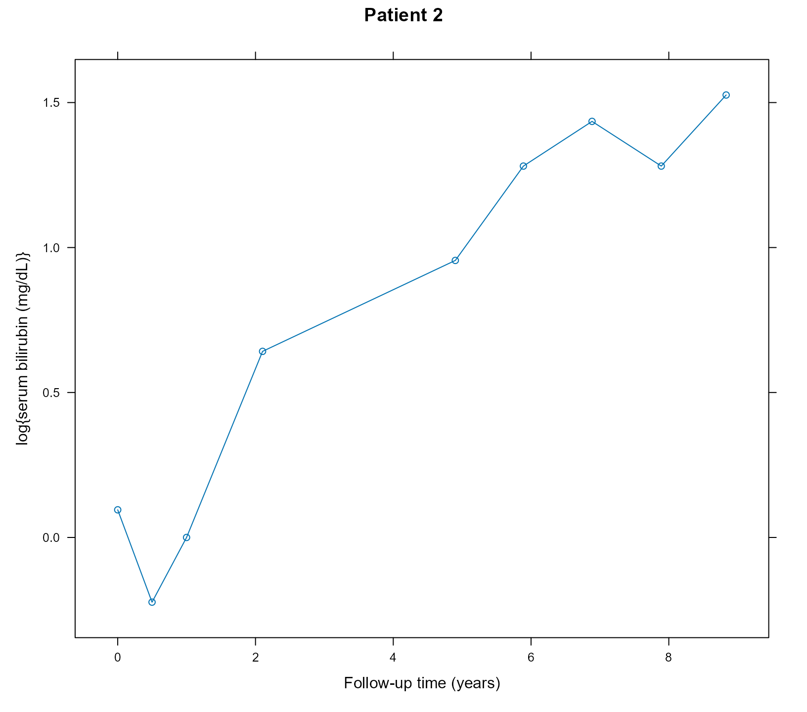

# Causal Effects

## Causal Effects from Joint Models

We will illustrate the calculation of causal effects from joint models
using the PBC dataset for the longitudinal outcome `serBilir` and the
composite event transplantation or death. We start by fitting a joint
model to the data. In the longitudinal submodel, we specify nonlinear
subject-specific trajectories using natural cubic splines. In the
fixed-effects part, we also include the treatment effect and its
interaction with time. In the survival submodel, we only include the
treatment effect.

``` r

pbc2.id$status2 <- as.numeric(pbc2.id$status != "alive")
lmeFit <- lme(log(serBilir) ~ ns(year, 3, B = c(0, 14.4)) * drug, 
                   data = pbc2, random = ~ ns(year, 3, B = c(0, 14.4)) | id,
                   control = lmeControl(opt = "optim"))
CoxFit <- coxph(Surv(years, status2) ~ drug, data = pbc2.id)
jmFit <- jm(CoxFit, lmeFit, time_var = "year")
summary(jmFit)
#> 
#> Call:
#> JMbayes2::jm(Surv_object = CoxFit, Mixed_objects = lmeFit, time_var = "year")
#> 
#> Data Descriptives:
#> Number of groups: 312        Number of events: 169 (54.2%)
#> Number of observations:
#>   log(serBilir): 1945
#> 
#>                  DIC     WAIC      LPML
#> marginal    4299.465 4683.969 -3083.300
#> conditional 6504.107 6249.080 -3470.014
#> 
#> Random-effects covariance matrix:
#>                                                                       
#>                    StdDev   Corr                                      
#> (Intr)             0.9952 (Intr) n(,3,B=c(0,14.4))1 n(,3,B=c(0,14.4))2
#> n(,3,B=c(0,14.4))1 1.5252 0.2199                                      
#> n(,3,B=c(0,14.4))2 1.7081 0.4481 0.7168                               
#> n(,3,B=c(0,14.4))3 1.9617 0.4451 0.1663             0.6811            
#> 
#> Survival outcome:
#>                         Mean  StDev    2.5%  97.5%      P   Rhat
#> drugD-penicil        -0.0187 0.2074 -0.4135 0.3790 0.9204 1.0120
#> value(log(serBilir))  1.2907 0.0882  1.1210 1.4634 0.0000 1.0741
#> 
#> Longitudinal outcome: log(serBilir) (family = gaussian, link = identity)
#>                        Mean  StDev    2.5%  97.5%      P   Rhat
#> (Intercept)          0.5856 0.0820  0.4257 0.7487 0.0000 0.9997
#> ns(,3,B=c(0,14.4))1  1.1457 0.1761  0.7961 1.4997 0.0000 1.0215
#> ns(,3,B=c(0,14.4))2  2.1875 0.2557  1.7402 2.7301 0.0000 2.1044
#> ns(,3,B=c(0,14.4))3  2.3944 0.4079  1.7144 3.2219 0.0000 2.5316
#> drugD-penicil       -0.1040 0.1164 -0.3347 0.1247 0.3638 1.0009
#> n(,3,B=c(0,14.4))1:  0.1856 0.2402 -0.2854 0.6501 0.4389 1.0475
#> n(,3,B=c(0,14.4))2: -0.4786 0.2993 -1.0691 0.1095 0.1149 1.4567
#> n(,3,B=c(0,14.4))3: -0.6995 0.4444 -1.5822 0.1721 0.1207 1.7222
#> sigma                0.2885 0.0063  0.2765 0.3014 0.0000 1.0287
#> 
#> MCMC summary:
#> chains: 3 
#> iterations per chain: 3500 
#> burn-in per chain: 500 
#> thinning: 1 
#> time: 16 sec
```

The coefficient for `drugD-penicil` for the survival outcome in the
output produced by the
[`summary()`](https://rdrr.io/r/base/summary.html) method denotes the
residual/direct effect of treatment on the risk of the composite event.
It does not include the effect of treatment that follows via the serum
bilirubin pathway.

We will illustrate the calculation of causal risk differences for the
group of patients that have the same distribution of serum bilirubin
values as Patient 2:

``` r

xyplot(log(serBilir) ~ year, data = pbc2, subset = id == 2, type = "b",
       xlab = "Follow-up time (years)", ylab = "log{serum bilirubin (mg/dL)}",
       main = "Patient 2")
```



We calculate the risk difference for the composite event between the
active treatment D-penicillamine and placebo at the horizon time
`t_horiz = 6` using the longitudinal data up to year `t0 = 4`. To
achieve this, we create a dataset with this patient’s data. This patient
received the active treatment D-penicillamine; hence, we also create a
version of her data with the `drug` variable set to `placebo`:

``` r

t0 <- 4
t_horiz <- 6
dataP2_Dpenici <- pbc2[pbc2$id == 2 & pbc2$year <= t0, ]
dataP2_Dpenici$years <- t0
dataP2_Dpenici$status2 <- 0

dataP2_placebo <- dataP2_Dpenici
dataP2_placebo$drug <- factor("placebo", levels = levels(pbc2$drug))
```

Note that in the `dataP2_placebo` dataset, we need to specify that
`drug` is a factor with two levels. We also specify that the last time
point we know the patient was still event-free was `t0`.

We estimate the cumulative risk for the composite event at `t_horiz`
under the active treatment arm using the
[`predict()`](https://rdrr.io/r/stats/predict.html) method:

``` r

Pr1 <- predict(jmFit, newdata = dataP2_Dpenici, process = "event", 
               times = t_horiz, return_mcmc = TRUE)
```

We have set the argument `return_mcmc` to `TRUE` to enable the
calculation of a credible interval that accounts for the MCMC
uncertainty. We produce the same estimate under the placebo arm:

``` r

Pr0 <- predict(jmFit, newdata = dataP2_placebo, process = "event", 
               times = t_horiz, return_mcmc = TRUE)
```

The estimated risk difference and its 95% credible interval are
calculated by the corresponding elements of the `Pr1` and `Pr0` objects,
i.e.,

``` r

# estimate 
Pr1$pred[2L] - Pr0$pred[2L]
#> [1] -0.002945748

# MCMC variability
quantile(Pr1$mcmc[2L, ] - Pr0$mcmc[2L, ], probs = c(0.025, 0.975))
#>       2.5%      97.5% 
#> -0.1931788  0.1579895
```

### Time-varying treatments

An extended example with time-varying treatments / intermediate events
that showcases a calculation of the variance of the causal effects that
includes the sampling variability is available
[here](https://github.com/drizopoulos/JMbayes2/blob/master/Development/CI/causal_effects.R).
