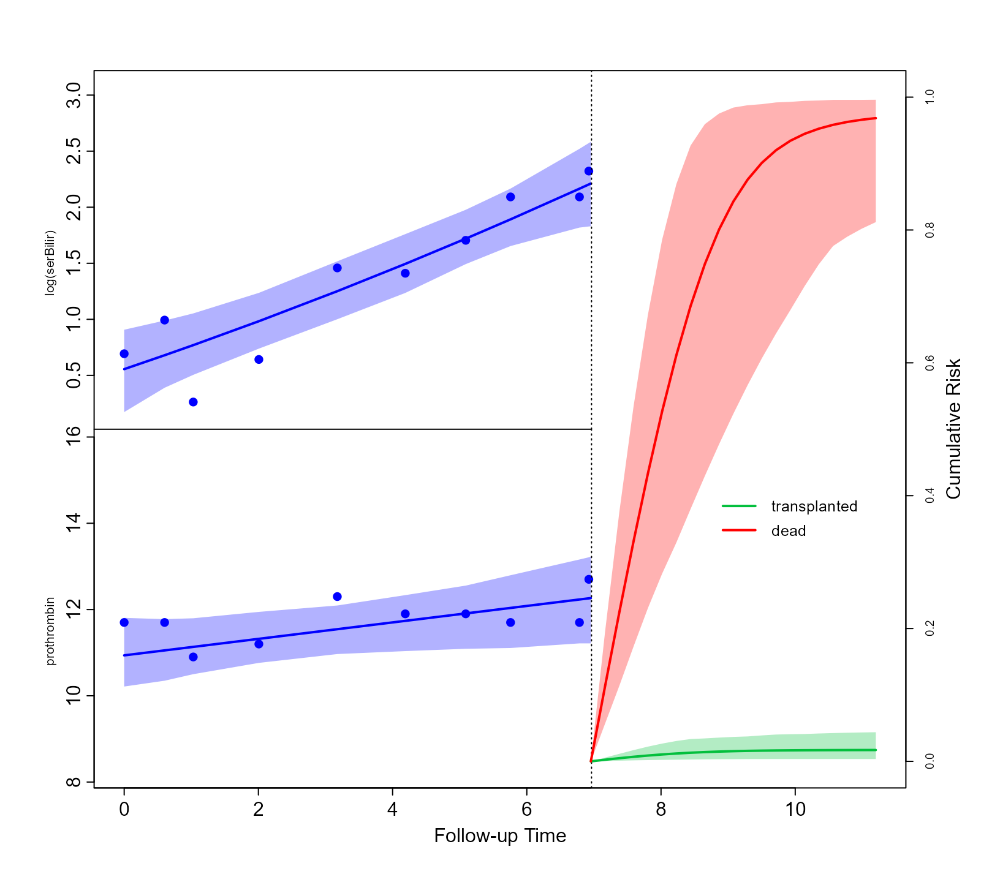

# Competing Risks

## Joint Models with Competing Risks

### Prepare data

The first step in fitting a joint model for competing events in
**JMbayes2** is to prepare the data for the event process. If there are
K competing events, each subject must have K rows, one for each possible
cause. The observed event time T_i of each subject is repeated K times,
and there are two indicator variables, namely one identifying the cause
and one indicating whether the corresponding event type is the one that
occurred. Standard survival datasets that include a single row per
patient can be easily transformed to the competing risks long format
using the function
[`crisk_setup()`](https://drizopoulos.github.io/JMbayes2/reference/cr_setup.md).
This function accepts as main arguments the survival data in the
standard format with a single row per patient, the name of the status
variable, and the level in this status variable that corresponds to
censoring. We illustrate the use of this function in the PBC data, where
we treat as competing risks transplantation and death:

``` r

pbc2.id[pbc2.id$id %in% c(1, 2, 5), c("id", "years", "status")]
#>   id     years       status
#> 1  1  1.095170         dead
#> 2  2 14.152338        alive
#> 5  5  4.120578 transplanted

pbc2.idCR <- crisk_setup(pbc2.id, statusVar = "status", censLevel = "alive", 
                         nameStrata = "CR")

pbc2.idCR[pbc2.idCR$id %in% c(1, 2, 5), 
          c("id", "years", "status", "status2", "CR")]
#>     id     years       status status2           CR
#> 1    1  1.095170         dead       1         dead
#> 1.1  1  1.095170         dead       0 transplanted
#> 2    2 14.152338        alive       0         dead
#> 2.1  2 14.152338        alive       0 transplanted
#> 5    5  4.120578 transplanted       0         dead
#> 5.1  5  4.120578 transplanted       1 transplanted
```

Note that each patient is now represented by two rows (we have two
possible causes of discontinuation from the study, death, and
transplantation), the event time variable `years` is identical in both
rows of each patient, variable `CR` denotes the cause for the specific
line of the long dataset, and variable `status2` equals 1 if the
corresponding event occurred.

### Fit models

For the event process, we specify cause-specific relative risk models.
Using dataset `pbc2.idCR`, we fit the corresponding cause-specific Cox
regressions by including the interaction terms of age and treatment with
variable `CR`, which is treated as a stratification variable using the
`strata()` function:

``` r

CoxFit_CR <- coxph(Surv(years, status2) ~ (age + drug):strata(CR),
                     data = pbc2.idCR)
```

We include two longitudinal outcomes for the longitudinal process: serum
bilirubin and the prothrombin time. For the former, we use quadratic
orthogonal polynomials in the fixed- and random-effects parts, and for
the latter, linear evolutions:

``` r

fm1 <- lme(log(serBilir) ~ poly(year, 2) * drug, data = pbc2, 
           random = ~ poly(year, 2) | id)
fm2 <- lme(prothrombin ~ year * drug, data = pbc2, random = ~ year | id)
```

To specify that each longitudinal outcome has a separate association
coefficient per competing risk, we define the corresponding functional
forms:

``` r

CR_forms <- list(
    "log(serBilir)" = ~ value(log(serBilir)):CR,
    "prothrombin" = ~ value(prothrombin):CR
)
```

Finally, the competing risks joint model is fitted with the following
call to [`jm()`](https://drizopoulos.github.io/JMbayes2/reference/jm.md)
(due to the complexity of the model, we have increased the number of
MCMC iterations and the burn-in period per chain). Also, because
relatively few patients received a transplantation, we specify a Weibull
baseline hazard function for this competing event, and the default
penalized B-spline approximation for death:

``` r

jFit_CR <- jm(CoxFit_CR, list(fm1, fm2), time_var = "year", 
              functional_forms = CR_forms, 
              base_hazard = c("weibull", NA),
              n_iter = 25000L, n_burnin = 5000L, n_thin = 5L)

summary(jFit_CR)
#> 
#> Call:
#> JMbayes2::jm(Surv_object = CoxFit_CR, Mixed_objects = list(fm1, 
#>     fm2), time_var = "year", functional_forms = CR_forms, base_hazard = c("weibull", 
#>     NA), n_iter = 25000L, n_burnin = 5000L, n_thin = 5L)
#> 
#> Data Descriptives:
#> Number of groups: 312        Number of events: 169 (27.1%)
#> Number of observations:
#>   log(serBilir): 1945
#>   prothrombin: 1945
#> 
#>                 DIC     WAIC      LPML
#> marginal    10819.8 11467.41 -6679.627
#> conditional 15751.0 15432.58 -8242.411
#> 
#> Random-effects covariance matrix:
#>                                              
#>        StdDev    Corr                        
#> (Intr) 1.3401  (Intr)  p(,2)1  p(,2)2  (Intr)
#> p(,2)1 22.9737 0.7069                        
#> p(,2)2 12.3268 -0.2674 -0.1569               
#> (Intr) 0.7856  0.6309  0.4381  -0.3383       
#> year   0.3260  0.4343  0.3390  -0.0526 0.0382
#> 
#> Survival outcome:
#>                                         Mean  StDev    2.5%   97.5%      P
#> age:strata(CR)transplanted           -0.0814 0.0258 -0.1330 -0.0345 0.0003
#> age:strata(CR)dead                    0.0649 0.0100  0.0456  0.0845 0.0000
#> drugD-penicil:strata(CR)transplanted -0.2776 0.4007 -1.0899  0.5003 0.4855
#> drugD-penicil:strata(CR)dead          0.0093 0.1855 -0.3560  0.3728 0.9633
#> value(log(serBilir)):CRtransplanted   1.0609 0.2247  0.6427  1.5238 0.0000
#> value(log(serBilir)):CRdead           1.4634 0.1209  1.2431  1.7152 0.0000
#> value(prothrombin):CRtransplanted    -0.0191 0.1660 -0.3568  0.2803 0.9800
#> value(prothrombin):CRdead             0.1524 0.0459  0.0598  0.2388 0.0020
#>                                        Rhat
#> age:strata(CR)transplanted           1.0441
#> age:strata(CR)dead                   1.0037
#> drugD-penicil:strata(CR)transplanted 1.0028
#> drugD-penicil:strata(CR)dead         1.0034
#> value(log(serBilir)):CRtransplanted  1.0163
#> value(log(serBilir)):CRdead          1.0028
#> value(prothrombin):CRtransplanted    1.0690
#> value(prothrombin):CRdead            1.0205
#> 
#> Longitudinal outcome: log(serBilir) (family = gaussian, link = identity)
#>                   Mean  StDev     2.5%   97.5%      P   Rhat
#> (Intercept)     1.2018 0.1137   0.9817  1.4254 0.0000 1.0021
#> poly(year, 2)1 27.9842 3.0032  22.3257 34.0046 0.0000 1.0107
#> poly(year, 2)2  1.1464 1.7370  -2.2534  4.5100 0.5102 1.0078
#> drugD-penicil  -0.1949 0.1575  -0.5005  0.1106 0.2212 1.0005
#> p(,2)1         -3.3225 3.5589 -10.3708  3.5614 0.3517 1.0040
#> p(,2)2         -1.0363 2.1608  -5.1852  3.2323 0.6315 1.0051
#> sigma           0.3025 0.0062   0.2907  0.3150 0.0000 1.0001
#> 
#> Longitudinal outcome: prothrombin (family = gaussian, link = identity)
#>                       Mean  StDev    2.5%   97.5%      P   Rhat
#> (Intercept)        10.6369 0.0835 10.4718 10.7996 0.0000 1.0012
#> year                0.2932 0.0395  0.2173  0.3730 0.0000 1.0034
#> drugD-penicil      -0.0968 0.1168 -0.3249  0.1318 0.4060 1.0001
#> year:drugD-penicil -0.0233 0.0519 -0.1271  0.0781 0.6562 1.0003
#> sigma               1.0547 0.0203  1.0152  1.0946 0.0000 1.0033
#> 
#> MCMC summary:
#> chains: 3 
#> iterations per chain: 25000 
#> burn-in per chain: 5000 
#> thinning: 5 
#> time: 3.2 min
```

### Dynamic predictions

Based on the fitted competing risks joint model, we will illustrate how
(dynamic) predictions can be calculated for the cause-specific
cumulative risk probabilities. As an example, we will show these
calculations for Patient 81 from the PBC dataset. First, we extract the
data on this subject.

``` r

ND_long <- pbc2[pbc2$id == 81, ]
ND_event <- pbc2.idCR[pbc2.idCR$id == 81, ]
ND_event$status2 <- 0
ND <- list(newdataL = ND_long, newdataE = ND_event)
```

The first line extracts the longitudinal measurements, and the second
line extracts the event times per cause (i.e., death and
transplantation). This patient died at 6.95 years, but to make the
calculation of cause-specific cumulative risk more relevant, we presume
that she did not have the event, and we set the event status variable
`status2` to zero. The last line combines the two datasets in a list.
*Note:* this last step is a prerequisite from the
[`predict()`](https://rdrr.io/r/stats/predict.html) method for competing
risks joint model. That is, the datasets provided in the arguments
`newdata` and `newdata2` need to be named lists with two components. The
first component needs to be named `newdataL` and contain the dataset
with the longitudinal measurements. The second component needs to be
named `newdataE` and contain the dataset with the event information.

The predictions are calculated using the
[`predict()`](https://rdrr.io/r/stats/predict.html) method. The first
call to this function calculates the prediction for the longitudinal
outcomes at the times provided in the `times` argument, and the second
call calculates the cause-specific cumulative risk probabilities. By
setting the argument `return_newdata` to `TRUE` in both calls, we can
use the corresponding
[`plot()`](https://rdrr.io/r/graphics/plot.default.html) method to
depict the predictions:

``` r

predLong <- predict(jFit_CR, newdata = ND, return_newdata = TRUE,
                    times = seq(6.5, 15, length = 25))

predEvent <- predict(jFit_CR, newdata = ND, return_newdata = TRUE,
                     process = "event")

plot(predLong, predEvent, outcomes = 1:2, ylim_long_outcome_range = FALSE,
     col_line_event = c("#03BF3D", "#FF0000"), 
     fill_CI_event = c("#03BF3D4D", "#FF00004D"), pos_ylab_long = c(1.5, 11.5))
legend(x = 8.1, y = 0.45, legend = levels(pbc2.idCR$CR), 
       lty = 1, lwd = 2, col = c("#03BF3D", "#FF0000"), bty = "n", cex = 0.8)
```


