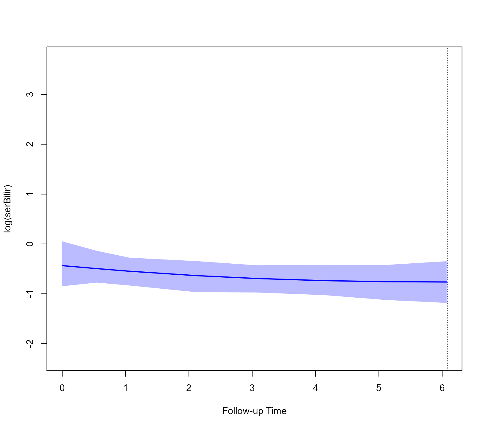
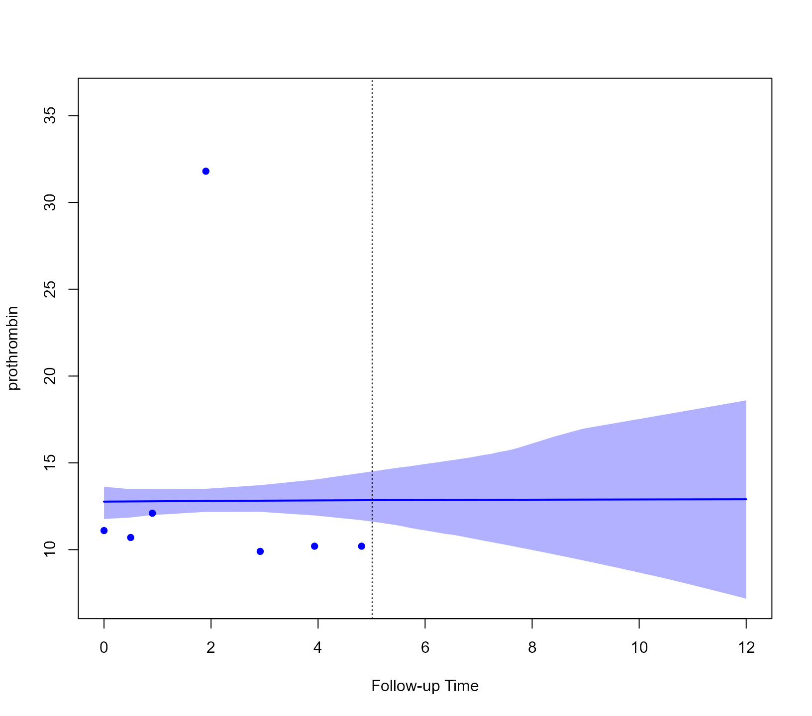
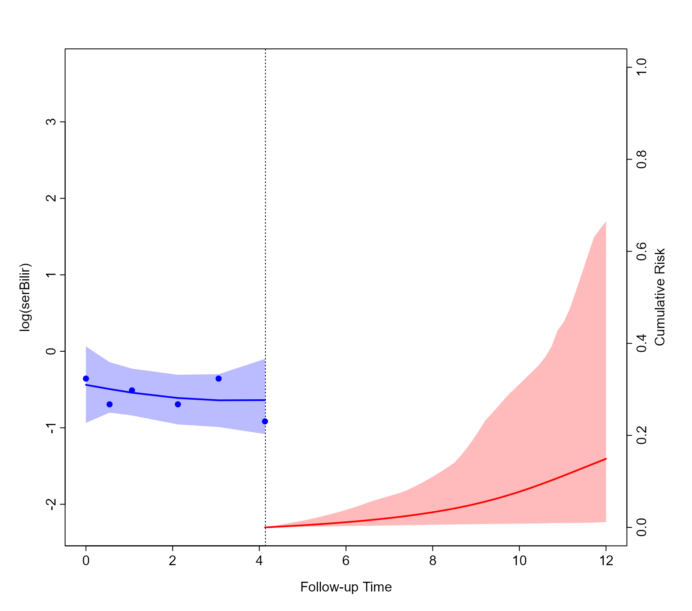
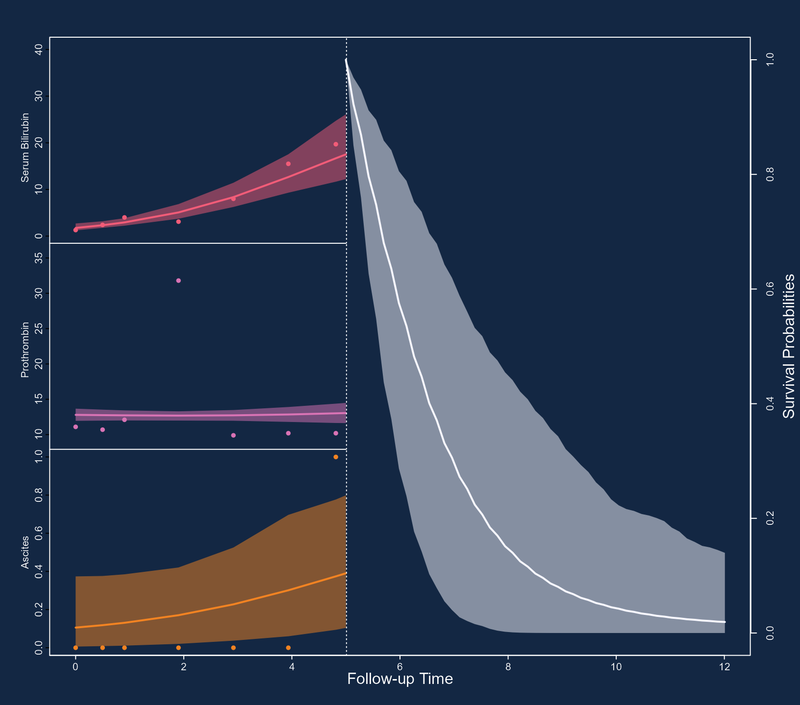
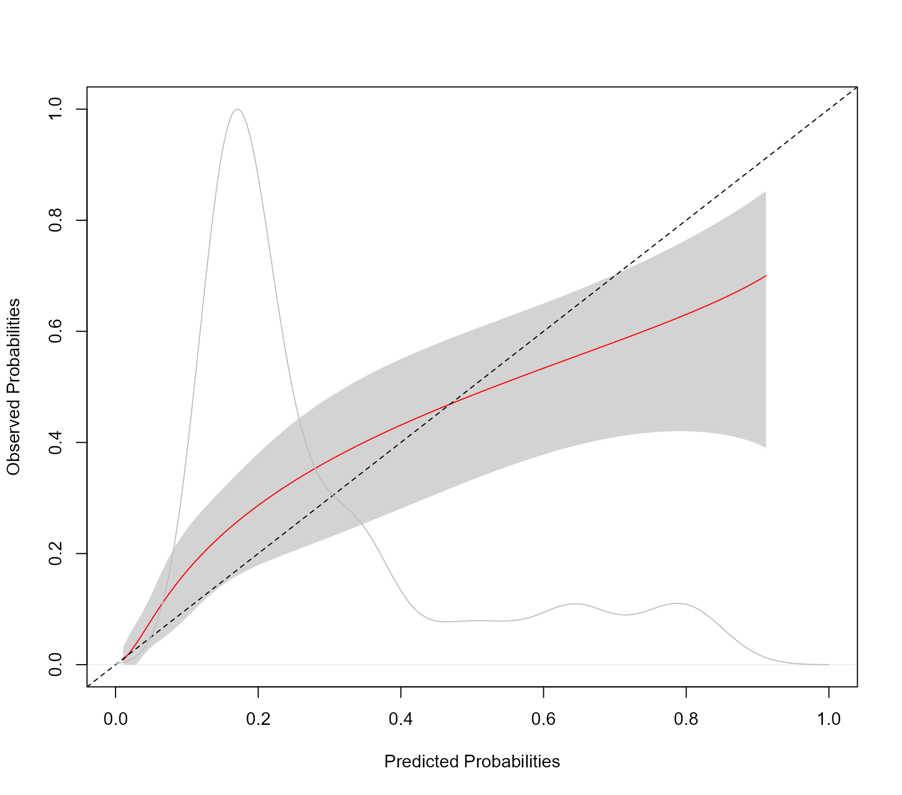

# Dynamic Predictions

## Dynamic Predictions from Joint Models

### Theory

Based on the general framework of joint models presented earlier, we are
interested in deriving cumulative risk probabilities for a new subject j
that has survived up to time point t and has provided longitudinal
measurements \mathcal Y\_{kj}(t) = \\ y\_{kj}(t\_{jl}); 0 \leq t\_{jl}
\leq t, l = 1, \ldots, n_j, k = 1, \ldots, K\\, with K denoting the
number of longitudinal outcomes. The probabilities of interest are
\begin{array}{l} \pi_j(u \mid t) = \mathrm{Pr}\\T_j^\* \leq u \mid
T_j^\* \> t, \mathcal Y_j(t), \mathcal D_n\\\\\\ = \displaystyle 1 -
\int\int \frac{S(u \mid b_j, \theta)}{S(t \mid b_j, \theta)} \\ p\\b_j
\mid T_j^\* \> t, \mathcal Y_j(t), \theta\\ \\ p(\theta \mid \mathcal
D_n) \\ db_j d\theta, \end{array} where S(\cdot) denotes the survival
function conditional on the random effects and \mathcal Y_j(t) =
\\\mathcal Y\_{1j}(t), \ldots, \mathcal Y\_{Kj}(t)\\. Combining the
three terms in the integrand, we can devise a Monte Carlo scheme to
obtain estimates of these probabilities, namely,

1.  Sample a value \tilde \theta from the posterior of the parameters
    \[\theta \mid \mathcal D_n\].

2.  Sample a value \tilde b_j from the posterior of the random effects
    \[b_j \mid T_j^\* \> t, \mathcal Y_j(t), \tilde \theta\].

3.  Compute the ratio of survival probabilities S(u \mid \tilde b_j,
    \tilde \theta) \Big / S(t \mid \tilde b_j, \tilde \theta).

Replicating these steps L times, we can estimate the conditional
cumulative risk probabilities by 1 - \frac{1}{L} \sum\_{l=1}^L \frac{S(u
\mid \tilde b_j^{(l)}, \tilde \theta^{(l)})}{S(t \mid \tilde b_j^{(l)},
\tilde \theta^{(l)})}, and their standard error by calculating the
standard deviation across the Monte Carlo samples.

### Example

We will illustrate the calculation of dynamic predictions using package
**JMbayes2** from a trivariate joint model fitted to the PBC dataset for
the longitudinal outcomes `serBilir` (continuous), `prothrombin` time
(continuous), and `ascites` (dichotomous). We start by fitting the
univariate mixed models. For the two continuous outcomes, we allow for
nonlinear subject-specific time effects using natural cubic splines. For
`ascites`, we postulate linear subject-specific profiles for the log
odds. The code is:

``` r
fm1 <- lme(log(serBilir) ~ ns(year, 3) * sex, data = pbc2,
           random = ~ ns(year, 3) | id, control = lmeControl(opt = 'optim'))

fm2 <- lme(prothrombin ~ ns(year, 2) * sex, data = pbc2,
           random = ~ ns(year, 2) | id, control = lmeControl(opt = 'optim'))

fm3 <- mixed_model(ascites ~ year * sex, data = pbc2,
                   random = ~ year | id, family = binomial())
```

Following, we fit the Cox model for the time to either transplantation
or death. The first line defines the composite event indicator, and the
second one fits the Cox model in which we have also included the
baseline covariates `drug` and `age`. The code is:

``` r
pbc2.id$event <- as.numeric(pbc2.id$status != "alive")
CoxFit <- coxph(Surv(years, event) ~ drug + age, data = pbc2.id)
```

The joint model is fitted with the following call to
[`jm()`](https://drizopoulos.github.io/JMbayes2/reference/jm.md):

``` r
jointFit <- jm(CoxFit, list(fm1, fm2, fm3), time_var = "year")
```

We want to calculate predictions for the longitudinal and survival
outcomes for Patients 25 and 93. As a first step, we extract the data of
these patients and store them in the data.frame `ND` with the code:

``` r
t0 <- 5
ND <- pbc2[pbc2$id %in% c(25, 93), ]
ND <- ND[ND$year < t0, ]
ND$event <- 0
ND$years <- t0
```

We will only use the first five years of follow-up (line three) and
specify that the patients were event-free up to this point (lines four
and five).

We start with predictions for the longitudinal outcomes. These are
produced by the [`predict()`](https://rdrr.io/r/stats/predict.html)
method for class `jm` objects and follow the same lines as the procedure
described above for cumulative risk probabilities. The only difference
is in Step 3, where instead of calculating the cumulative risk, we
calculate the predicted values for the longitudinal outcomes. There are
two options controlled by the `type_pred` argument, namely predictions
at the scale of the response/outcome (default) or at the linear
predictor level. The `type` argument controls whether the predictions
will be for the mean subject (i.e., including only the fixed effects) or
subject-specific, including both the fixed and random effects. In the
`newdata` argument we provide the available measurements of the two
patients. This will be used to sample their random effects in Step 2,
presented above. This is done with a Metropolis-Hastings algorithm that
runs for `n_mcmc` iterations; all iterations but the last one are
discarded as burn-in. Finally, argument `n_samples` corresponds to the
value of L defined above and specifies the number of Monte Carlo
samples:

``` r
predLong1 <- predict(jointFit, newdata = ND, return_newdata = TRUE)
```

Argument `return_newdata` specifies that the predictions are returned as
extra columns of the `newdata` data.frame. By default, the 95% credible
intervals are also included. Using the
[`plot()`](https://rdrr.io/r/graphics/plot.default.html) method for
objects returned by `predict.jm(..., return_newdata = TRUE)`, we can
display the predictions. With the following code, we do that for the
first longitudinal outcome:

``` r
plot(predLong1)
```



When we want to calculate predictions for other future time points, we
can accordingly specify the `times` argument. In the following example,
we calculate predictions from time `t0` to time 12:

``` r
predLong2 <- predict(jointFit, newdata = ND,
                     times = seq(t0, 12, length.out = 51),
                     return_newdata = TRUE)
```

We show these predictions for the second outcome and the second patient
(i.e., Patient 93). This is achieved by suitably specifying the
`outcomes` and `subject` arguments of the
[`plot()`](https://rdrr.io/r/graphics/plot.default.html) method:

``` r
plot(predLong2, outcomes = 2, subject = 93)
```



We continue with the predictions for the event outcome. To let
[`predict()`](https://rdrr.io/r/stats/predict.html) know that we want
the cumulative risk probabilities, we specify `process = "event"`:

``` r
predSurv <- predict(jointFit, newdata = ND, process = "event",
                    times = seq(t0, 12, length.out = 51),
                    return_newdata = TRUE)
```

The predictions are included again as extra columns in the corresponding
data.frame. To depict the predictions of both the longitudinal and
survival outcomes combined, we provide both objects to the
[`plot()`](https://rdrr.io/r/graphics/plot.default.html) method:

``` r
plot(predLong2, predSurv)
```



Again, by default, the plot is for the predictions of the first subject
(i.e., Patient 25) and the first longitudinal outcome (i.e.,
`log(serBilir)`). However, the
[`plot()`](https://rdrr.io/r/graphics/plot.default.html) method has a
series of arguments that allow users to customize the plot. We
illustrate some of these capabilities with the following figure. First,
we specify that we want to depict all three outcomes using
`outcomes = 1:3` (note: a max of three outcomes can be simultaneously
displayed). Next, we specify via the `subject` argument that we want to
show the predictions of Patient 93. Note that for serum bilirubin, we
used the log transformation in the specification of the linear mixed
model. Hence, we receive predictions on the transformed scale. To show
predictions on the original scale, we use the `fun_long` argument.
Because we have three outcomes, this needs to be a list of three
functions. The first one, corresponding to serum bilirubin, is the
[`exp()`](https://rdrr.io/r/base/Log.html), and for the other two the
[`identity()`](https://rdrr.io/r/base/identity.html) because we do not
wish to transform the predictions. Analogously, we also have the
`fun_event` argument to transform the predictions for the event outcome,
and in the example below, we set the goal of obtaining survival
probabilities. Using the arguments `bg`, `col_points`, `col_line_long`,
`col_line_event`, `fill_CI_long`, and `fill_CI_event`, we have changed
the appearance of the plot to a dark theme. Finally, the `pos_ylab_long`
specifies the relative positive of the y-axis labels for the three
longitudinal outcomes.

``` r
cols <- c('#F25C78', '#D973B5', '#F28322')
plot(predLong2, predSurv, outcomes = 1:3, subject = 93,
     fun_long = list(exp, identity, identity),
     fun_event = function (x) 1 - x,
     ylab_event = "Survival Probabilities",
     ylab_long = c("Serum Bilirubin", "Prothrombin", "Ascites"),
     bg = '#132743', col_points = cols, col_line_long = cols,
     col_line_event = '#F7F7FF', col_axis = "white", 
     fill_CI_long = c("#F25C7880", "#D973B580", "#F2832280"),
     fill_CI_event = "#F7F7FF80",
     pos_ylab_long = c(1.9, 1.9, 0.08))
```



### Predictive accuracy

We evaluate the discriminative capability of the model using ROC
methodology. We calculate the components of the ROC curve using
information up to year five, and we are interested in events occurring
within a three-year window. That is discriminating between patients who
will get the event in the interval `(t0, t0 + Dt]`, (i.e., in our case
T_j \in (5, 8\]) from patients who will survive at least 8 years (i.e.,
T_j \> 8). The calculations are performed with the following call to
[`tvROC()`](https://drizopoulos.github.io/JMbayes2/reference/accuracy.md):

``` r
pbc2$event <- as.numeric(pbc2$status != "alive")
roc <- tvROC(jointFit, newdata = pbc2, Tstart = t0, Dt = 3)
roc
#> 
#>  Time-dependent Sensitivity and Specificity for the Joint Model jointFit
#> 
#> At time: 8
#> Using information up to time: 5 (202 subjects still at risk)
#> Accounting for censoring using model-based weights
#> 
#>    cut-off      SN      SP  
#> 1     0.00 0.00000 1.00000  
#> 2     0.03 0.01513 0.99812  
#> 3     0.08 0.03648 0.99812  
#> 4     0.09 0.03648 0.99168  
#> 5     0.11 0.10052 0.99168  
#> 6     0.12 0.11871 0.99072  
#> 7     0.13 0.11871 0.98428  
#> 8     0.14 0.11871 0.97783  
#> 9     0.16 0.15223 0.97506  
#> 10    0.18 0.17358 0.97506  
#> 11    0.20 0.21628 0.97506  
#> 12    0.21 0.23763 0.97506  
#> 13    0.25 0.25898 0.97506  
#> 14    0.27 0.28033 0.97506  
#> 15    0.30 0.32303 0.97506  
#> 16    0.31 0.34438 0.96862  
#> 17    0.33 0.37464 0.96486  
#> 18    0.36 0.41734 0.95842  
#> 19    0.37 0.41842 0.95230  
#> 20    0.40 0.43977 0.95230  
#> 21    0.44 0.47216 0.94919  
#> 22    0.46 0.49351 0.94919  
#> 23    0.48 0.53621 0.94919  
#> 24    0.52 0.53621 0.94274  
#> 25    0.53 0.53621 0.93630  
#> 26    0.55 0.53621 0.92985  
#> 27    0.56 0.57891 0.92985  
#> 28    0.58 0.60026 0.92985  
#> 29    0.65 0.60026 0.92341  
#> 30    0.66 0.62161 0.92341 *
#> 31    0.67 0.62429 0.91133  
#> 32    0.68 0.62429 0.90488  
#> 33    0.69 0.62466 0.89855  
#> 34    0.70 0.62466 0.89210  
#> 35    0.71 0.65737 0.86975  
#> 36    0.72 0.66079 0.85145  
#> 37    0.73 0.68214 0.84500  
#> 38    0.74 0.68625 0.83980  
#> 39    0.75 0.68827 0.82108  
#> 40    0.76 0.69335 0.80327  
#> 41    0.78 0.71470 0.78394  
#> 42    0.79 0.71976 0.77258  
#> 43    0.80 0.72024 0.76628  
#> 44    0.82 0.72769 0.74919  
#> 45    0.83 0.72996 0.73699  
#> 46    0.84 0.75692 0.71935  
#> 47    0.85 0.77904 0.70025  
#> 48    0.86 0.80261 0.68802  
#> 49    0.87 0.80679 0.66995  
#> 50    0.88 0.80679 0.66351  
#> 51    0.89 0.83360 0.63937  
#> 52    0.90 0.85677 0.60770  
#> 53    0.91 0.86058 0.55729  
#> 54    0.92 0.88370 0.52560  
#> 55    0.93 0.88683 0.42987  
#> 56    0.94 0.92953 0.40409  
#> 57    0.95 0.95217 0.32714  
#> 58    0.96 0.97586 0.24407  
#> 59    0.97 0.97829 0.15457  
#> 60    0.98 0.97829 0.09656  
#> 61    0.99 0.99989 0.01286  
#> 62    1.00 1.00000 0.00000
```

In the first line we define the event indicator as we did in the
`pbc2.id` data.frame. The cut-point with the asterisk on the right
maximizes the [Youden’s
index](https://en.wikipedia.org/wiki/Youden%27s_J_statistic). To depict
the ROC curve, we use the corresponding
[`plot()`](https://rdrr.io/r/graphics/plot.default.html) method:


The area under the ROC curve is calculated with the
[`tvAUC()`](https://drizopoulos.github.io/JMbayes2/reference/accuracy.md)
function:

``` r
tvAUC(roc)
#> 
#>  Time-dependent AUC for the Joint Model jointFit
#> 
#> Estimated AUC:  0.8282
#> At time: 8
#> Using information up to time: 5 (202 subjects still at risk)
#> Accounting for censoring using model-based weights
```

This function either accepts an object of class `tvROC` or of class
`jm`. In the latter case, the user must also provide the `newdata`,
`Tstart` and `Dt` or `Thoriz` arguments. Here we have used the same
dataset as the one to fit the model, but, in principle, discrimination
could be (better) assessed in another dataset.

The
[`tvROC()`](https://drizopoulos.github.io/JMbayes2/reference/accuracy.md)
and
[`tvAUC()`](https://drizopoulos.github.io/JMbayes2/reference/accuracy.md)
functions also work for Cox regression models for right censored data.
We compare the added value of using the longitudinal data compared to
only using the baseline value of the markers,

``` r
baseline_Cox <- coxph(Surv(years, event) ~ drug + age + log(serBilir) + 
                          prothrombin + ascites, data = pbc2.id)
tvAUC(baseline_Cox, newdata = pbc2.id, Tstart = t0, Dt = 3)
#> 
#>  Time-dependent AUC for the Cox Model baseline_Cox
#> 
#> Estimated AUC:  0.6736
#> At time: 8
#> Using information up to time: 5 (202 subjects still at risk)
#> Accounting for censoring using model-based weights
```

To assess the accuracy of the predictions, we produce a calibration
plot:

``` r
calibration_plot(jointFit, newdata = pbc2, Tstart = t0, Dt = 3)
```



The syntax of the
[`calibration_plot()`](https://drizopoulos.github.io/JMbayes2/reference/accuracy.md)
function is almost identical to that of
[`tvROC()`](https://drizopoulos.github.io/JMbayes2/reference/accuracy.md).
The kernel density estimation is of the estimated probabilities
\pi_j(t + \Delta t \mid t) = \pi_j(8 \mid 5) for all individuals at risk
at year `t0` in the data frame provided in the `newdata` argument. The
grey shaded area represents the 95% pointwise confidence intervals of
the predicted cumulative risks probabilities. Using the
[`calibration_metrics()`](https://drizopoulos.github.io/JMbayes2/reference/accuracy.md)
function we can also calculate metrics for the accuracy of predictions:

``` r
calibration_metrics(jointFit, pbc2, Tstart = 5, Dt = 3)
#>        ICI        E50        E90 
#> 0.02984699 0.02453557 0.05820965
```

The ICI is the mean absolute difference between the observed and
predicted probabilities, E50 is the median absolute difference, and E90
is the 90% percentile of the absolute differences. Finally, we calculate
the Brier score as an overall measure of predictive performance. This is
computed with the
[`tvBrier()`](https://drizopoulos.github.io/JMbayes2/reference/accuracy.md)
function:

``` r
tvBrier(jointFit, newdata = pbc2, Tstart = t0, Dt = 3)
#> 
#> Prediction Error for the Joint Model 'jointFit'
#> 
#> Estimated Brier score: 0.1242
#> At time: 8
#> For the 202 subjects at risk at time 5
#> Number of subjects with an event in [5, 8): 40
#> Number of subjects with a censored time in [5, 8): 58
#> Accounting for censoring using model-based weights
```

The Brier score evaluates the predictive accuracy at time `Tstart + Dt`.
To summarize the predictive accuracy in the interval `(t0, t0 + Dt]` we
can use the integrated Brier score. The corresponding integral is
approximated using the Simpson’s rule:

``` r
tvBrier(jointFit, newdata = pbc2, Tstart = t0, Dt = 3, integrated = TRUE)
#> 
#> Prediction Error for the Joint Model 'jointFit'
#> 
#> Estimated Integrated Brier score: 0.0829
#> In the time interval: [5, 8)
#> For the 202 subjects at risk at time 5
#> Number of subjects with an event in [5, 8): 40
#> Number of subjects with a censored time in [5, 8): 58
#> Accounting for censoring using model-based weights
```

Function
[`tvBrier()`](https://drizopoulos.github.io/JMbayes2/reference/accuracy.md)
also works for Cox models, e.g.,

``` r
tvBrier(baseline_Cox, newdata = pbc2.id, Tstart = t0, Dt = 3, integrated = TRUE)
#> 
#> Prediction Error for the Cox Model 'baseline_Cox'
#> 
#> Estimated Integrated Brier score: 0.1163
#> In the time interval: [5, 8)
#> For the 202 subjects at risk at time 5
#> Number of subjects with an event in [5, 8): 40
#> Number of subjects with a censored time in [5, 8): 58
#> Accounting for censoring using model-based weights
```

The
[`tvBrier()`](https://drizopoulos.github.io/JMbayes2/reference/accuracy.md)
and
[`tvROC()`](https://drizopoulos.github.io/JMbayes2/reference/accuracy.md)
also implement inverse probability of censoring weights to account for
censoring in the interval `(t0, t0 + Dt]` using the Kaplan-Meier
estimate of the censoring distribution (however, see the note below):

``` r
tvBrier(jointFit, newdata = pbc2, Tstart = t0, Dt = 3, integrated = TRUE,
        type_weights = "IPCW")
#> 
#> Prediction Error for the Joint Model 'jointFit'
#> 
#> Estimated Integrated Brier score: 0.0841
#> In the time interval: [5, 8)
#> For the 202 subjects at risk at time 5
#> Number of subjects with an event in [5, 8): 40
#> Number of subjects with a censored time in [5, 8): 58
#> Accounting for censoring using inverse probability of censoring Kaplan-Meier weights
```

**Notes:**

- To obtain valid estimates of the predictive accuracy measures (i.e.,
  time-varying sensitivity, specificity, and Brier score) we need to
  account for censoring. A popular method to achieve this is via the
  inverse probability of censoring weighting. For this approach to be
  valid, we need the model for the weights to be correctly specified. In
  standard survival analysis, this is achieved either using the
  Kaplan-Meier estimator or a Cox model for the censoring distribution.
  However, in the settings where joint models are used, it is often the
  case that the censoring mechanism may depend on the history of the
  longitudinal outcomes in a complex manner. This is especially the case
  when we consider multiple longitudinal outcomes in the analysis. Also,
  these outcomes may be recorded at different time points per patient
  and have missing data. Because of these reasons, in these settings,
  Kaplan-Meier-based or Cox-based censoring weights may be difficult to
  derive or be biased. The functions in **JMbayes2** that calculate the
  predictive accuracy measures use joint-model-based weights to account
  for censoring. These weights allow censoring to depend in any possible
  manner on the history of the longitudinal outcomes. However, they
  require that the model is appropriately calibrated.
- The calibration curve, produced by
  [`calibration_plot()`](https://drizopoulos.github.io/JMbayes2/reference/accuracy.md),
  and the calibration metrics, produced by `calibration_metrics())`, are
  calculated using the procedure described in [Austin et al.,
  2020](https://doi.org/10.1002/sim.8570).

### Internal Validation

#### Cross-Validation

In calculating the predictive accuracy measures presented above, we used
the same dataset in which we fitted the models. This is known to produce
overoptimistic accuracy estimates. More objective estimates can be
obtained using internal validation. This section illustrates how
internal validation can be performed in **JMbayes2** using
cross-validation and the Bootstrap methods.

Both testing and training datasets for both techniques can be created
using the
[`create_folds()`](https://drizopoulos.github.io/JMbayes2/reference/accuracy.md)
function. We start with cross-validation and split the `pbc2` database
into five folds using the syntax:

``` r
CVdats <- create_folds(pbc2, V = 5, id_var = "id")
```

The first argument for this function is the `data.frame` we wish to
split into `V` folds. The argument `id_var` specifies the name of the
subject’s id variable in this dataset. The output of
[`create_folds()`](https://drizopoulos.github.io/JMbayes2/reference/accuracy.md)
is a list with two components named `"training"` and `"testing"`. Each
component is another list with `V` data.frames.

Next, we define the function that will fit the joint models we wish to
consider for calculating predictions. This function should have as a
single argument a `data.frame` that will be used to fit the joint
models. We will use parallel computing to optimize computational
performance and fit these models to the different training datasets.
Hence, within the function we should have the call
[`library("JMbayes2")`](https://drizopoulos.github.io/JMbayes2/) to load
package **JMbayes2** for each worker. The output of this function is the
fitted joint model we wish to internally validate.

``` r
fit_model <- function (data) {
    library("JMbayes2")
    # data
    data$event <- as.numeric(data$status != "alive")
    data_id <- data[!duplicated(data$id), ]
    # mixed-effects models
    fm1 <- lme(log(serBilir) ~ ns(year, 3) * sex, data = data,
               random = list(id = pdDiag(form = ~ ns(year, 3))), 
               control = lmeControl(opt = 'optim'))
    fm2 <- lme(prothrombin ~ ns(year, 2) * sex, data = data,
               random = list(id = pdDiag(form = ~ ns(year, 2))), 
               control = lmeControl(opt = 'optim'))
    fm3 <- mixed_model(ascites ~ year * sex, data = data,
                       random = ~ year | id, family = binomial())
    # Cox model
    CoxFit <- coxph(Surv(years, event) ~ drug + age, data = data_id)
    # joint model
    jm(CoxFit, list(fm1, fm2, fm3), time_var = "year")
}
```

We fit the model in the training datasets using parallel computing as
facilitated by the **parallel** package (*note*: this and the subsequent
computations require some time to perform depending on the capabilities
of your computing environment):

``` r
cl <- parallel::makeCluster(5L)
Model_folds <- parallel::parLapply(cl, CVdats$training, fit_model)
parallel::stopCluster(cl)
```

Before calculating the predictive accuracy measures in the testing
datasets, we must create the `event` variable in each one. This is
achieved with the following piece of code:

``` r
CVdats$testing[] <- lapply(CVdats$testing, function (d) {
    d$event <- as.numeric(d$status != "alive")
    d
})
```

The following syntax calculates the integrated Brier score in the
testing datasets at follow-up year `t0 = 5` and for a window of `Dt = 3`
years (we use parallel computing again):

``` r
calculate_Brier <- function (v, models, testing_data) {
    library("JMbayes2")
    tvBrier(models[[v]], newdata = testing_data[[v]], Tstart = 5, Dt = 3, 
            integrated = TRUE)
}

cl <- parallel::makeCluster(5L)
Brier_per_fold <- 
    parallel::parLapply(cl, seq_len(5), calculate_Brier, models = Model_folds,
                        testing_data = CVdats$testing)
parallel::stopCluster(cl)
```

The cross-validated estimate of the integrated Brier score is the
average of the estimated Brier scores in the testing datasets:

``` r
average_Brier <- mean(sapply(Brier_per_fold, "[[", "Brier"))
average_Brier
#> [1] 0.0862818
```

The calculation of the cross-validated estimate of the AUC at follow-up
year 5 and for a window of 3 years proceeds similarly:

``` r
calculate_AUC <- function (v, models, testing_data) {
    library("JMbayes2")
    tvAUC(models[[v]], newdata = testing_data[[v]], Tstart = 5, Dt = 3)
}

cl <- parallel::makeCluster(5L)
AUC_per_fold <- 
    parallel::parLapply(cl, seq_len(5), calculate_AUC, models = Model_folds,
                        testing_data = CVdats$testing)
parallel::stopCluster(cl)

average_AUC <- mean(sapply(AUC_per_fold, "[[", "auc"))
average_AUC
#> [1] 0.8183163
```

#### Bootstrap

We continue the illustration of internal validation in **JMbayes2**
using the Bootstrap method. The training and testing datasets are again
created with the
[`create_folds()`](https://drizopoulos.github.io/JMbayes2/reference/accuracy.md)
function by specifying `method = "Bootstrap"`:

``` r
bootDats <- create_folds(pbc2, V = 10, id_var = "id", method = "Bootstrap")
```

Argument `V` now denotes the number of Bootstrap samples we want to
create. Each training Bootstrap sample is a sample with replacement from
the original dataset `pbc2`. The subjects not used in the specific
Bootstrap sample form the testing dataset. We fit the joint model in the
training datasets using parallel computing:

``` r
cl <- parallel::makeCluster(5L)
Model_bootSamples <- parallel::parLapply(cl, bootDats$training, fit_model)
parallel::stopCluster(cl)
```

Before calculating the predictive accuracy measures in the testing
datasets, we must create again the `event` variable in each one.

``` r
bootDats$testing[] <- lapply(bootDats$testing, function (d) {
    d$event <- as.numeric(d$status != "alive")
    d
})
```

Following we calculate the integrated Brier score in each testing
dataset and compute the average:

``` r
cl <- parallel::makeCluster(10L)
Brier_per_bootSample <- 
    parallel::parLapply(cl, seq_len(10), calculate_Brier, models = Model_bootSamples,
                        testing_data = bootDats$testing)
parallel::stopCluster(cl)

average_Brier_bootSamples <- mean(sapply(Brier_per_bootSample, "[[", "Brier"))
```

The evaluation of the model’s predictive accuracy in the testing
datasets will produce a pessimistic estimate of model performance. On
the contrary, the estimate of the integrate Brier score in the `pbc2`
dataset used to fit the joint model will be highly optimistic:

``` r
jointFit <- fit_model(pbc2)

Brier_original <- tvBrier(jointFit, newdata = pbc2, Tstart = t0, Dt = 3, 
                          integrated = TRUE)
```

[Efron and Tibshirani
(1997)](https://doi.org/10.1080/01621459.1997.10474007) proposed the
.632 estimator, which combines the performance obtained in the original
dataset and the estimates from the Bootstrap samples to reduce the
upward bias:

``` r
0.368 * Brier_original$Brier + 0.632 * average_Brier_bootSamples
#> [1] 0.08199523
```

We perform the same calculations also for the AUC:

``` r
cl <- parallel::makeCluster(10L)
AUC_per_bootSample <- 
    parallel::parLapply(cl, seq_len(10), calculate_AUC, models = Model_bootSamples,
                        testing_data = bootDats$testing)
parallel::stopCluster(cl)

average_AUC_bootSamples <- mean(sapply(AUC_per_bootSample, "[[", "auc"))

AUC_original <- tvAUC(jointFit, newdata = pbc2, Tstart = t0, Dt = 3)

0.368 * AUC_original$auc + 0.632 * average_AUC_bootSamples
#> [1] 0.8165295
```

A 95% confidence interval for the AUC in the original sample can be
derived by calculating the AUC in the Bootstrap training samples, i.e.,

``` r
bootDats$training[] <- lapply(bootDats$training, function (d) {
    d$event <- as.numeric(d$status != "alive")
    d
})

cl <- parallel::makeCluster(10L)
AUC_per_bootSample_training <- 
    parallel::parLapply(cl, seq_len(10), calculate_AUC, models = Model_bootSamples, 
                        testing_data = bootDats$training)
parallel::stopCluster(cl)
AUC_per_bootSample_training <- sapply(AUC_per_bootSample_training, "[[", "auc")

AUC_original
#> 
#>  Time-dependent AUC for the Joint Model jointFit
#> 
#> Estimated AUC:  0.8175
#> At time: 8
#> Using information up to time: 5 (202 subjects still at risk)
#> Accounting for censoring using model-based weights

# 95% Bootstrap CI
quantile(AUC_per_bootSample_training, probs = c(0.025, 0.975))
#>      2.5%     97.5% 
#> 0.7765123 0.8436562
```
