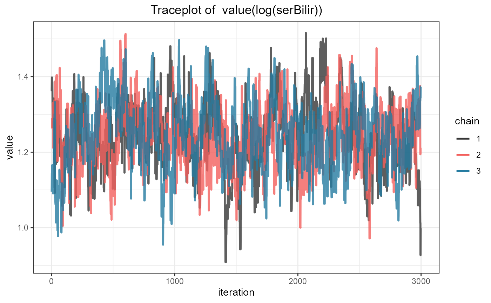
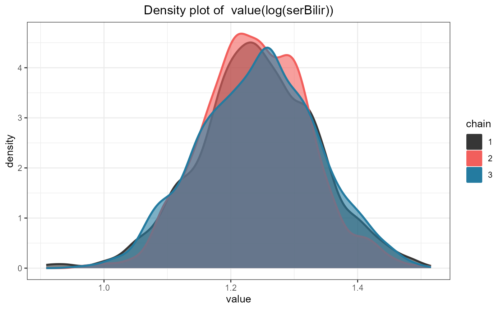

# Univariate and Multivariate Joint Models

## Fitting Joint Models with JMbayes2

### Univariate

The function that fits joint models in **JMbayes2** is called
[`jm()`](https://drizopoulos.github.io/JMbayes2/reference/jm.md). It has
three required arguments, `Surv_object` a Cox model fitted by
[`coxph()`](https://drizopoulos.github.io/JMbayes2/reference/sliced_model_generics.md)
or an Accelerated Failure time model fitted by
[`survreg()`](https://rdrr.io/pkg/survival/man/survreg.html),
`Mixed_objects` a single or a list of mixed models fitted either by the
[`lme()`](https://drizopoulos.github.io/JMbayes2/reference/sliced_model_generics.md)
or
[`mixed_model()`](https://drizopoulos.github.io/JMbayes2/reference/sliced_model_generics.md)
functions, and `time_var` a character string indicating the name of the
time variable in the specification of the mixed-effects models. We will
illustrate the basic use of the package in the PBC dataset. We start by
fitting a Cox model for the composite event transplantation or death,
including sex as a baseline covariate:

``` r

pbc2.id$status2 <- as.numeric(pbc2.id$status != 'alive')
CoxFit <- coxph(Surv(years, status2) ~ sex, data = pbc2.id)
```

We aim to assess the strength of the association between the risk of the
composite event and the serum bilirubin levels collected during
follow-up. We will describe the patient-specific profiles over time for
this biomarker using a linear mixed model, with fixed effects, time,
sex, and their interaction, and as random effects, random intercepts,
and random slopes. The syntax to fit this model with
[`lme()`](https://drizopoulos.github.io/JMbayes2/reference/sliced_model_generics.md)
is:

``` r

fm1 <- lme(log(serBilir) ~ year * sex, data = pbc2, random = ~ year | id)
```

The joint model that links the survival and longitudinal submodels is
fitted with the following call to the
[`jm()`](https://drizopoulos.github.io/JMbayes2/reference/jm.md)
function:

``` r

jointFit1 <- jm(CoxFit, fm1, time_var = "year")
summary(jointFit1)
#> 
#> Call:
#> JMbayes2::jm(Surv_object = CoxFit, Mixed_objects = fm1, time_var = "year")
#> 
#> Data Descriptives:
#> Number of groups: 312        Number of events: 169 (54.2%)
#> Number of observations:
#>   log(serBilir): 1945
#> 
#>                  DIC     WAIC      LPML
#> marginal    4360.329 5330.306 -3120.145
#> conditional 3536.960 3356.698 -1914.927
#> 
#> Random-effects covariance matrix:
#>                     
#>        StdDev   Corr
#> (Intr) 0.9993 (Intr)
#> year   0.1834 0.4041
#> 
#> Survival outcome:
#>                         Mean  StDev    2.5%  97.5%     P   Rhat
#> sexfemale            -0.1640 0.2702 -0.6738 0.4076 0.526 1.0022
#> value(log(serBilir))  1.2418 0.0894  1.0698 1.4198 0.000 1.0089
#> 
#> Longitudinal outcome: log(serBilir) (family = gaussian, link = identity)
#>                   Mean  StDev    2.5%   97.5%      P   Rhat
#> (Intercept)     0.7223 0.1729  0.3841  1.0599 0.0000 1.0000
#> year            0.2662 0.0380  0.1918  0.3409 0.0000 1.0013
#> sexfemale      -0.2629 0.1843 -0.6249  0.1071 0.1553 1.0000
#> year:sexfemale -0.0878 0.0400 -0.1663 -0.0076 0.0307 1.0015
#> sigma           0.3467 0.0067  0.3338  0.3601 0.0000 1.0233
#> 
#> MCMC summary:
#> chains: 3 
#> iterations per chain: 3500 
#> burn-in per chain: 500 
#> thinning: 1 
#> time: 14 sec
```

The output of the [`summary()`](https://rdrr.io/r/base/summary.html)
method provides some descriptive statistics of the sample at hand,
followed by some fit statistics based on the marginal (random effects
are integrated out using the Laplace approximation) and conditional on
the random effects log-likelihood functions, followed by the estimated
variance-covariance matrix for the random effects, followed by the
estimates for the survival submodel, followed by the estimates for the
longitudinal submodel(s), and finally some information for the MCMC
fitting algorithm.

By default,
[`jm()`](https://drizopoulos.github.io/JMbayes2/reference/jm.md) adds
the subject-specific linear predictor of the mixed model as a
time-varying covariate in the survival relative risk model. In the
output, this is named as `value(log(serBilir))` to denote that, by
default, the current value functional form is used. That is, we assume
that the instantaneous risk of an event at a specific time t is
associated with the value of the linear predictor of the longitudinal
outcome at the same time point t.

Standard MCMC diagnostics are available to evaluate convergence. For
example, the traceplot for the association coefficient
`value(log(serBilir))` is produced with the following syntax:

``` r

ggtraceplot(jointFit1, "alphas")
```



and the density plot with the call:

``` r

ggdensityplot(jointFit1, "alphas")
```



#### Notes

- The ordering of the subjects in the datasets used to fit the mixed and
  Cox regression models needs to be the same.

- The units of the time variables in the mixed and Cox models need to be
  the same.

### Multivariate

To fit a joint model with multiple longitudinal outcomes, we provide a
list of mixed models as the second argument of
[`jm()`](https://drizopoulos.github.io/JMbayes2/reference/jm.md). In the
following example, we extend the joint model we fitted above by
including the prothrombin time and the log odds of the presence or
absence of ascites as time-varying covariates in the relative risk model
for the composite event. Ascites is a dichotomous outcome, and
therefore, we fit a mixed-effects logistic regression model for it using
the
[`mixed_model()`](https://drizopoulos.github.io/JMbayes2/reference/sliced_model_generics.md)
function from the **GLMMadaptive** package. The use of `||` in the
`random` argument of
[`mixed_model()`](https://drizopoulos.github.io/JMbayes2/reference/sliced_model_generics.md)
specifies that the random intercepts and random slopes are assumed
uncorrelated. In addition, the argument `which_independent` can be used
to determine which longitudinal outcomes are to be assumed independent;
here, as an illustration, we specify that the first (i.e., serum
bilirubin) and second (i.e., prothrombin time) longitudinal outcomes are
independent. To assume that all longitudinal outcomes are independent,
we can use `jm(..., which_independent = "all")`. Because this joint
model is more complex, we increase the number of MCMC iterations, the
number of burn-in iterations, and the thinning per chain using the
corresponding control arguments:

``` r

fm2 <- lme(prothrombin ~ year * sex, data = pbc2, random = ~ year | id)
fm3 <- mixed_model(ascites ~ year + sex, data = pbc2,
                   random = ~ year || id, family = binomial())

jointFit2 <- jm(CoxFit, list(fm1, fm2, fm3), time_var = "year",
                which_independent = cbind(1, 2),
                n_iter = 12000L, n_burnin = 2000L, n_thin = 5L)
summary(jointFit2)
#> 
#> Call:
#> JMbayes2::jm(Surv_object = CoxFit, Mixed_objects = list(fm1, 
#>     fm2, fm3), time_var = "year", which_independent = cbind(1, 
#>     2), n_iter = 12000L, n_burnin = 2000L, n_thin = 5L)
#> 
#> Data Descriptives:
#> Number of groups: 312        Number of events: 169 (54.2%)
#> Number of observations:
#>   log(serBilir): 1945
#>   prothrombin: 1945
#>   ascites: 1885
#> 
#>                  DIC     WAIC      LPML
#> marginal    11670.79 13918.64 -7850.173
#> conditional 12890.30 12618.74 -6829.707
#> 
#> Random-effects covariance matrix:
#>                                                   
#>        StdDev   Corr                              
#> (Intr) 1.0011 (Intr)   year (Intr)    year  (Intr)
#> year   0.1870 0.4485                              
#> (Intr) 0.7606                                     
#> year   0.3249               -0.0094               
#> (Intr) 2.7283 0.5081 0.4677 0.3281  -0.0193       
#> year   0.4710 0.4095 0.6679 -0.0562 0.3308        
#> 
#> Survival outcome:
#>                         Mean  StDev    2.5%  97.5%      P   Rhat
#> sexfemale            -0.6516 0.3628 -1.3646 0.0573 0.0707 1.0227
#> value(log(serBilir))  0.5053 0.1806  0.0918 0.8220 0.0187 1.0645
#> value(prothrombin)   -0.0491 0.1255 -0.3163 0.1812 0.7197 1.0313
#> value(ascites)        0.6012 0.1590  0.3630 0.9985 0.0000 1.0970
#> 
#> Longitudinal outcome: log(serBilir) (family = gaussian, link = identity)
#>                   Mean  StDev    2.5%   97.5%     P   Rhat
#> (Intercept)     0.6988 0.1664  0.3729  1.0254 0.000 1.0018
#> year            0.2692 0.0353  0.2026  0.3402 0.000 1.0145
#> sexfemale      -0.2404 0.1761 -0.5866  0.0994 0.174 1.0026
#> year:sexfemale -0.0798 0.0365 -0.1508 -0.0093 0.025 1.0056
#> sigma           0.3481 0.0067  0.3350  0.3616 0.000 1.0001
#> 
#> Longitudinal outcome: prothrombin (family = gaussian, link = identity)
#>                   Mean  StDev    2.5%   97.5%      P   Rhat
#> (Intercept)    10.9835 0.1697 10.6495 11.3137 0.0000 1.0004
#> year            0.2108 0.0765  0.0644  0.3622 0.0073 1.0089
#> sexfemale      -0.4402 0.1793 -0.7969 -0.0878 0.0133 1.0002
#> year:sexfemale  0.0449 0.0801 -0.1120  0.1990 0.5587 1.0094
#> sigma           1.0574 0.0201  1.0180  1.0980 0.0000 1.0011
#> 
#> Longitudinal outcome: ascites (family = binomial, link = logit)
#>                Mean  StDev    2.5%   97.5%      P   Rhat
#> (Intercept) -4.5182 0.7170 -5.9852 -3.1921 0.0000 1.0372
#> year         0.6412 0.0758  0.4919  0.7903 0.0000 1.1858
#> sexfemale   -0.5461 0.6665 -1.8009  0.8123 0.4063 1.0067
#> 
#> MCMC summary:
#> chains: 3 
#> iterations per chain: 12000 
#> burn-in per chain: 2000 
#> thinning: 5 
#> time: 1.2 min
```

The survival submodel output now contains the estimated coefficients for
`value(prothrombin)` and `value(ascites)`, as well as parameter
estimates for all three longitudinal submodels.

### Functional forms

As mentioned above, the default call to
[`jm()`](https://drizopoulos.github.io/JMbayes2/reference/jm.md)
includes the subject-specific linear predictors of the mixed-effects
models as time-varying covariates in the relative risk model. However,
this is just one of the many possibilities for linking longitudinal and
survival outcomes. The argument `functional_forms` of
[`jm()`](https://drizopoulos.github.io/JMbayes2/reference/jm.md)
provides additional options. Based on previous experience, two extra
functional forms are provided: the time-varying slope and the
time-varying *normalized* area/cumulative effect. The time-varying slope
is the first-order derivative of the subject-specific linear predictor
of the mixed-effect model with respect to the (follow-up) time variable.
The time-varying *normalized* area/cumulative effect is the integral of
the subject-specific linear predictor of the mixed-effect model from
zero to the current (follow-up) time t divided by t. The integral is the
area under the subject-specific longitudinal profile; by dividing the
integral by t, we obtain the average of the subject-specific
longitudinal profile over the corresponding period (0, t).

To illustrate how the `functional_forms` argument can be used to specify
these functional forms, we update the joint model `jointFit2` by
including the time-varying slope of log serum bilirubin instead of the
value and also the interaction of this slope with sex and for
prothrombin we include the normalized cumulative effect. For ascites, we
keep the current value functional form. The corresponding syntax to fit
this model is:

``` r

fForms <- list(
  "log(serBilir)" = ~ slope(log(serBilir)) + slope(log(serBilir)):sex,
  "prothrombin"   = ~ JMbayes2::area(prothrombin)
)

jointFit3 <- update(jointFit2, functional_forms = fForms)
summary(jointFit3)
#> 
#> Call:
#> JMbayes2::jm(Surv_object = CoxFit, Mixed_objects = list(fm1, 
#>     fm2, fm3), time_var = "year", functional_forms = fForms, 
#>     which_independent = cbind(1, 2), n_iter = 12000L, n_burnin = 2000L, ...
#> 
#> Data Descriptives:
#> Number of groups: 312        Number of events: 169 (54.2%)
#> Number of observations:
#>   log(serBilir): 1945
#>   prothrombin: 1945
#>   ascites: 1885
#> 
#>                  DIC     WAIC      LPML
#> marginal    11677.49 12664.98 -7145.285
#> conditional 12732.64 12433.87 -6714.379
#> 
#> Random-effects covariance matrix:
#>                                                   
#>        StdDev   Corr                              
#> (Intr) 0.9970 (Intr)   year (Intr)    year  (Intr)
#> year   0.1854 0.4539                              
#> (Intr) 0.7517                                     
#> year   0.3235               -0.0116               
#> (Intr) 2.6165 0.5582 0.4572 0.3352  -0.0696       
#> year   0.4440 0.4287 0.6814 -0.0643 0.3569        
#> 
#> Survival outcome:
#>                                   Mean  StDev    2.5%  97.5%      P   Rhat
#> sexfemale                       0.2374 0.9255 -1.4933 2.0764 0.8293 1.0626
#> slope(log(serBilir))            4.2736 2.3254 -0.1641 9.0609 0.0587 1.1095
#> slope(log(serBilir)):sexfemale -3.8266 2.7833 -9.5928 1.2753 0.1470 1.1291
#> JMbayes2::area(prothrombin)    -0.3192 0.2554 -0.8104 0.1607 0.2173 1.3097
#> value(ascites)                  0.9859 0.2102  0.6436 1.4232 0.0000 1.4229
#> 
#> Longitudinal outcome: log(serBilir) (family = gaussian, link = identity)
#>                   Mean  StDev    2.5%   97.5%      P   Rhat
#> (Intercept)     0.6675 0.1656  0.3440  0.9860 0.0003 1.0001
#> year            0.2640 0.0341  0.1995  0.3332 0.0000 1.0117
#> sexfemale      -0.2060 0.1750 -0.5449  0.1379 0.2407 1.0001
#> year:sexfemale -0.0725 0.0347 -0.1420 -0.0054 0.0370 1.0103
#> sigma           0.3483 0.0067  0.3353  0.3615 0.0000 1.0027
#> 
#> Longitudinal outcome: prothrombin (family = gaussian, link = identity)
#>                   Mean  StDev    2.5%   97.5%      P   Rhat
#> (Intercept)    10.9914 0.1705 10.6690 11.3229 0.0000 1.0031
#> year            0.1913 0.0764  0.0395  0.3452 0.0097 1.0066
#> sexfemale      -0.4496 0.1798 -0.8035 -0.1019 0.0093 1.0028
#> year:sexfemale  0.0622 0.0799 -0.0947  0.2196 0.4357 1.0094
#> sigma           1.0585 0.0204  1.0198  1.1001 0.0000 1.0100
#> 
#> Longitudinal outcome: ascites (family = binomial, link = logit)
#>                Mean  StDev    2.5%   97.5%      P   Rhat
#> (Intercept) -4.4702 0.6505 -5.7837 -3.2464 0.0000 1.0520
#> year         0.6401 0.0704  0.5004  0.7827 0.0000 1.1036
#> sexfemale   -0.4340 0.6365 -1.6702  0.8437 0.4843 1.0087
#> 
#> MCMC summary:
#> chains: 3 
#> iterations per chain: 12000 
#> burn-in per chain: 2000 
#> thinning: 5 
#> time: 1.3 min
```

As seen above, the `functional_forms` argument is a named list with
elements corresponding to the longitudinal outcomes. If a longitudinal
outcome is not specified in this list, then the default value functional
form is used for that outcome. Each element of the list should be a
one-sided R formula in which the functions
[`value()`](https://drizopoulos.github.io/JMbayes2/reference/jm.md),
[`slope()`](https://drizopoulos.github.io/JMbayes2/reference/jm.md), and
[`area()`](https://drizopoulos.github.io/JMbayes2/reference/jm.md) can
be used. Interaction terms between the functional forms and other
(baseline) covariates are also allowed.

### Penalized Coefficients using Shrinkage Priors

When multiple longitudinal outcomes are considered with possibly
different functional forms per outcome, we require to fit a relative
risk model containing several terms. Moreover, it is often of scientific
interest to select which terms/functional forms per longitudinal outcome
are more strongly associated with the risk of the event of interest. To
facilitate this selection,
[`jm()`](https://drizopoulos.github.io/JMbayes2/reference/jm.md) allows
penalizing the regression coefficients using shrinkage priors. As an
example, we refit `jointFit3` by assuming a Horseshoe prior for the
`alphas` coefficients (i.e., the coefficients of the longitudinal
outcomes in the relative risk model):

``` r

jointFit4 <- update(jointFit3, priors = list("penalty_alphas" = "horseshoe"))
cbind("un-penalized" = unlist(coef(jointFit3)), 
      "penalized" = unlist(coef(jointFit4)))
#>                                            un-penalized  penalized
#> gammas.Mean                                   0.2374497 -0.5502744
#> association.slope(log(serBilir))              4.2736269  2.1417693
#> association.slope(log(serBilir)):sexfemale   -3.8265851 -0.8025063
#> association.JMbayes2::area(prothrombin)      -0.3192189 -0.1688748
#> association.value(ascites)                    0.9858689  0.8419852
```

Apart from the Horseshoe prior, the ridge prior is also provided.
