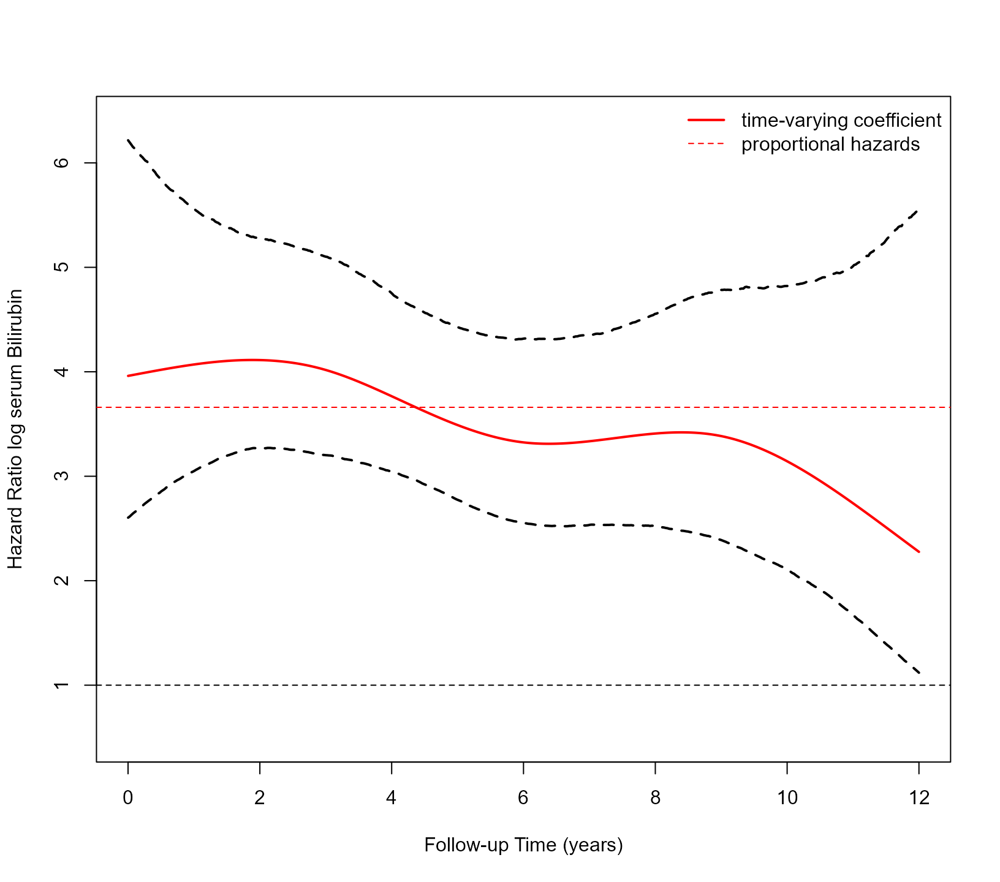

# Time Varying Effects

## Non Proportional Hazards

The basic definition of the joint model assumes the coefficients that
quantify the association between the versions of the longitudinal
outcomes and the hazard of the event are time-constant (i.e., the
proportional hazards assumption). We can relax this assumption by
specifying time-varying coefficients via the `functional_forms` argument
of function
[`jm()`](https://drizopoulos.github.io/JMbayes2/reference/jm.md).

We will illustrate this capability using the PBC dataset. We start by
fitting a Cox model for the composite event transplantation or death,
including sex as a baseline covariate:

``` r
pbc2.id$status2 <- as.numeric(pbc2.id$status != 'alive')
CoxFit <- coxph(Surv(years, status2) ~ sex, data = pbc2.id)
```

We aim to assess the strength of the association between the risk of the
composite event and the serum bilirubin level. We will describe the
patient-specific profiles over time for this biomarker using a linear
mixed-effects model, where we include an intercept in both the fixed and
random effects, as well as the linear and quadratic time effects. In the
fixed effects, we also include the interaction of the time effect and
sex. The syntax to fit this model with
[`lme()`](https://drizopoulos.github.io/JMbayes2/reference/sliced_model_generics.md)
is:

``` r
fm <- lme(log(serBilir) ~ poly(year, 2) * sex, data = pbc2, 
          random = ~ poly(year, 2) | id, control = lmeControl(opt = 'optim'))
```

The default call to
[`jm()`](https://drizopoulos.github.io/JMbayes2/reference/jm.md) adds
the subject-specific linear predictor of the mixed model as a
time-varying covariate in the survival relative risk model:

``` r
jointFit1 <- jm(CoxFit, fm, time_var = "year")
summary(jointFit1)
#> 
#> Call:
#> JMbayes2::jm(Surv_object = CoxFit, Mixed_objects = fm, time_var = "year")
#> 
#> Data Descriptives:
#> Number of Groups: 312        Number of events: 169 (54.2%)
#> Number of Observations:
#>   log(serBilir): 1945
#> 
#>                  DIC     WAIC      LPML
#> marginal    4346.937 6096.897 -3271.149
#> conditional 8713.787 8448.451 -4517.738
#> 
#> Random-effects covariance matrix:
#>                               
#>        StdDev    Corr         
#> (Intr) 1.3091  (Intr)  p(,2)1 
#> p(,2)1 21.6892 0.6786         
#> p(,2)2 12.1450 -0.2361 -0.1267
#> 
#> Survival Outcome:
#>                         Mean  StDev    2.5%  97.5%      P   Rhat
#> sexfemale            -0.1531 0.2625 -0.6448 0.3834 0.5444 1.0118
#> value(log(serBilir))  1.2974 0.0989  1.1169 1.5105 0.0000 1.0469
#> 
#> Longitudinal Outcome: log(serBilir) (family = gaussian, link = identity)
#>                   Mean  StDev     2.5%   97.5%      P   Rhat
#> (Intercept)     1.4897 0.2236   1.0479  1.9216 0.0000 1.0008
#> poly(year, 2)1 29.5318 5.1216  19.7020 39.8127 0.0000 1.0106
#> poly(year, 2)2 -4.8101 3.1672 -11.1911  1.2785 0.1256 1.0055
#> sexfemale      -0.4703 0.2386  -0.9310  0.0002 0.0502 1.0001
#> p(,2)1         -5.0308 5.3098 -15.6799  5.3492 0.3393 1.0088
#> p(,2)2          6.3008 3.2751  -0.1080 12.8040 0.0540 1.0120
#> sigma           0.3028 0.0061   0.2909  0.3149 0.0000 1.0077
#> 
#> MCMC summary:
#> chains: 3 
#> iterations per chain: 3500 
#> burn-in per chain: 500 
#> thinning: 1 
#> time: 18 sec
```

To specify that the association of serum bilirubin may change over time,
we include an interaction of this time-varying covariate with a natural
cubic spline of time using function
[`ns()`](https://rdrr.io/r/splines/ns.html) from the **splines**
package. **Important Note:** For this to work correctly, we need to
explicitly specify the internal and boundary knots for the B-splines
basis, i.e., in the following example, we set the internal knots at 3,
6, and 9 years, and the boundary knots at 0 and 14.5 years:

``` r
form_splines <- ~ value(log(serBilir)) * ns(year, k = c(3, 6, 9), B = c(0, 14.5))
jointFit2 <- update(jointFit1, functional_forms = form_splines, 
                    n_iter = 6500L, n_burnin = 2500L)
summary(jointFit2)
#> 
#> Call:
#> JMbayes2::jm(Surv_object = CoxFit, Mixed_objects = fm, time_var = "year", 
#>     functional_forms = form_splines, n_iter = 6500L, n_burnin = 2500L)
#> 
#> Data Descriptives:
#> Number of Groups: 312        Number of events: 169 (54.2%)
#> Number of Observations:
#>   log(serBilir): 1945
#> 
#>                  DIC     WAIC      LPML
#> marginal    4341.405 6355.209 -3701.785
#> conditional 8721.121 8458.791 -4518.159
#> 
#> Random-effects covariance matrix:
#>                               
#>        StdDev    Corr         
#> (Intr) 1.3165  (Intr)  p(,2)1 
#> p(,2)1 22.1410 0.6886         
#> p(,2)2 12.1107 -0.2160 -0.1051
#> 
#> Survival Outcome:
#>                                                                   Mean  StDev
#> sexfemale                                                      -0.1687 0.2778
#> value(log(serBilir))                                            1.3764 0.2307
#> value(log(serBilir)):ns(year, k = c(3, 6, 9), B = c(0, 14.5))1 -0.2749 0.2747
#> value(log(serBilir)):ns(year, k = c(3, 6, 9), B = c(0, 14.5))2 -0.0072 0.3547
#> value(log(serBilir)):ns(year, k = c(3, 6, 9), B = c(0, 14.5))3 -0.6068 0.7512
#> value(log(serBilir)):ns(year, k = c(3, 6, 9), B = c(0, 14.5))4 -1.1876 0.9046
#>                                                                   2.5%  97.5%
#> sexfemale                                                      -0.7010 0.3837
#> value(log(serBilir))                                            0.9567 1.8273
#> value(log(serBilir)):ns(year, k = c(3, 6, 9), B = c(0, 14.5))1 -0.8186 0.2543
#> value(log(serBilir)):ns(year, k = c(3, 6, 9), B = c(0, 14.5))2 -0.7200 0.7006
#> value(log(serBilir)):ns(year, k = c(3, 6, 9), B = c(0, 14.5))3 -2.0471 0.9432
#> value(log(serBilir)):ns(year, k = c(3, 6, 9), B = c(0, 14.5))4 -2.7763 0.6365
#>                                                                     P   Rhat
#> sexfemale                                                      0.5503 1.0000
#> value(log(serBilir))                                           0.0000 1.0511
#> value(log(serBilir)):ns(year, k = c(3, 6, 9), B = c(0, 14.5))1 0.3257 1.0029
#> value(log(serBilir)):ns(year, k = c(3, 6, 9), B = c(0, 14.5))2 0.9955 1.0172
#> value(log(serBilir)):ns(year, k = c(3, 6, 9), B = c(0, 14.5))3 0.4217 1.0656
#> value(log(serBilir)):ns(year, k = c(3, 6, 9), B = c(0, 14.5))4 0.2075 1.1052
#> 
#> Longitudinal Outcome: log(serBilir) (family = gaussian, link = identity)
#>                   Mean  StDev     2.5%   97.5%      P   Rhat
#> (Intercept)     1.4928 0.2264   1.0449  1.9387 0.0000 1.0071
#> poly(year, 2)1 30.0902 5.3321  19.8109 40.8594 0.0000 1.0643
#> poly(year, 2)2 -4.4062 3.2052 -10.5846  1.9815 0.1732 1.0559
#> sexfemale      -0.4713 0.2410  -0.9480  0.0006 0.0505 1.0053
#> p(,2)1         -5.3315 5.6721 -16.7089  5.5721 0.3432 1.0534
#> p(,2)2          6.0298 3.3524  -0.5961 12.6127 0.0733 1.0530
#> sigma           0.3030 0.0062   0.2907  0.3151 0.0000 1.0019
#> 
#> MCMC summary:
#> chains: 3 
#> iterations per chain: 6500 
#> burn-in per chain: 2500 
#> thinning: 1 
#> time: 36 sec
```

The spline coefficients do not have a straightforward interpretation.
We, therefore, visualize the time-varying association of log serum
bilirubin with the hazard of the composite event using the following
piece of code:

``` r
x_times <- seq(0.001, 12, length = 501)
X <- cbind(1, ns(x_times, knots = c(3, 6, 9), B = c(0, 14.5)))
mcmc_alphas <- do.call('rbind', jointFit2$mcmc$alphas)
log_hr <- X %*% t(mcmc_alphas)
log_hr_mean <- rowMeans(log_hr)
log_hr_low <- apply(log_hr, 1, quantile, probs = 0.025)
log_hr_upp <- apply(log_hr, 1, quantile, probs = 0.975)

matplot(x_times, cbind(exp(log_hr_mean), exp(log_hr_low), exp(log_hr_upp)), 
        type = "l", col = c("red", "black", "black"), lty = c(1, 2, 2), lwd = 2,
        xlab = "Follow-up Time (years)", ylab = "Hazard Ratio log serum Bilirubin",
        ylim = c(0.5, 6.4))
abline(h = exp(coef(jointFit1)$association), lty = 2, col = "red")
abline(h = 1, lty = 2)
legend("topright", c("time-varying coefficient", "proportional hazards"),
       lty = c(1, 2), lwd = c(2, 1), col = "red", bty = "n")
```



We observe that the 95% credible interval for the time-varying
coefficient includes the horizontal line corresponding to proportional
hazards. This is also confirmed by comparing the two models:

``` r
compare_jm(jointFit1, jointFit2)
#> 
#>                 DIC     WAIC      LPML
#>  jointFit1 4346.937 6096.897 -3271.149
#>  jointFit2 4341.405 6355.209 -3701.785
#> 
#> The criteria are calculated based on the marginal log-likelihood.
```

The WAIC and LPML indicate that `jointFit1` is a better model than
`jointFit2`. The DIC has the same magnitude for both models.
